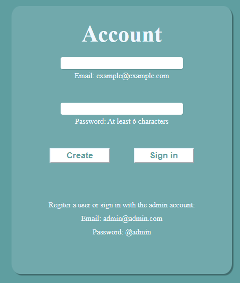
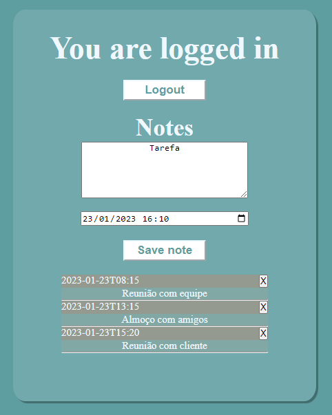

## Sobre o projeto
Neste projeto criei uma página web Agenda que usa o Cloud Firestore e o Authentication ambos do Firebase da Google. Todas as anotações, tarefas e compromissos datados ficam armazenados na nuvem e atrelados ao usuário que as criaram.

Foi implementado o login com usuário pré cadastrado, mas é possível cadastrar novos usuários usando o Authentication.

## Objetivo do projeto
-Aprender e praticar o desenvolvimento de códigos para requisições do tipo GET, POST e DELETE consumindo dados via API.

-Aprender e praticar criação e manipulação de banco de dados

 

 

## Sobre Cloud Firestore
O Cloud Firestore é um banco de dados de documentos NoSQL que permite armazenar, sincronizar e consultar dados facilmente para seus apps para dispositivos móveis e da Web, em escala global e em tempo real.

## Sobre o Authentication
O objetivo do Firebase Authentication é facilitar o desenvolvimento de um sistema de autenticação seguro. Ele oferece uma solução de identidade completa, compatível com contas de e-mail/senha, autenticação por telefone, login do Google, Twitter, Facebook, GitHub e outros.

 

